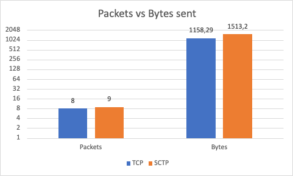
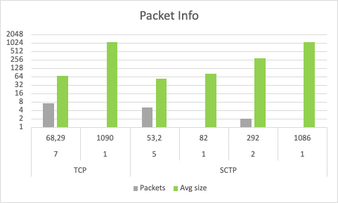

# Client-Server-Sniffer

Client/Server iimplementation in C language using TCP/SCTP protocols.

Application developed as workpaper for the Computer Network class. University of Vale do Rio dos Sinos, Brazil/Rio Grande do Sul.

## Description

### Goal
Develop a distributed protocol analyzer using TCPDUMP to collect the data and send it to all machines connected.
The system must have at least three nodes, each node must have client and serevr roles to send and receive TCPDUMP output file.
When executing the command "dump" in one terminal, all machines will need to run a TCPDUMP and generate the output file to send back to the requester.

### Sample run
To run you need to pass the other machine addresses as parameter before executing the program. Once all are up and listening you can execute "dump" in order to receive a dump file from all machines available.
Note that the TCPDUMP options are hardcoded and will only execute for 1 second.

### Comparison between protocols

